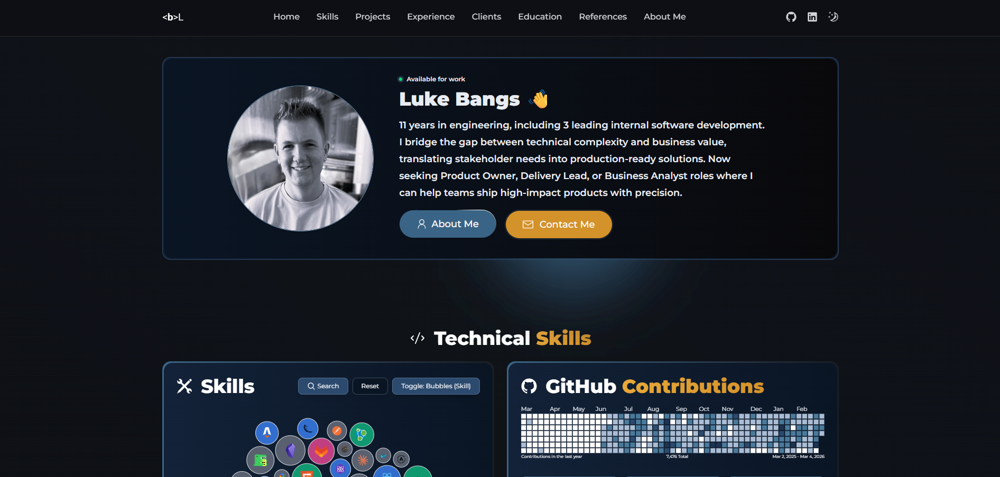
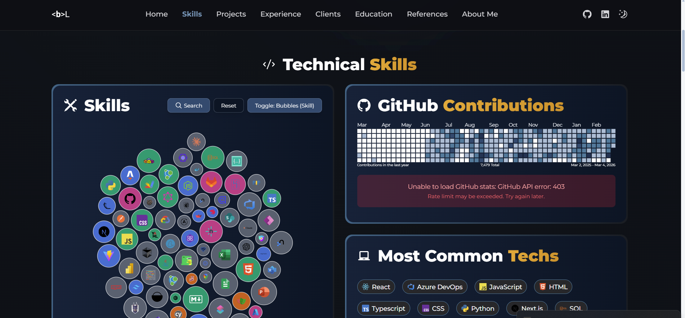
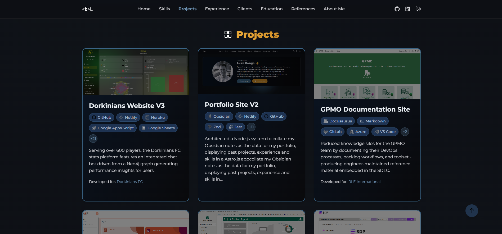
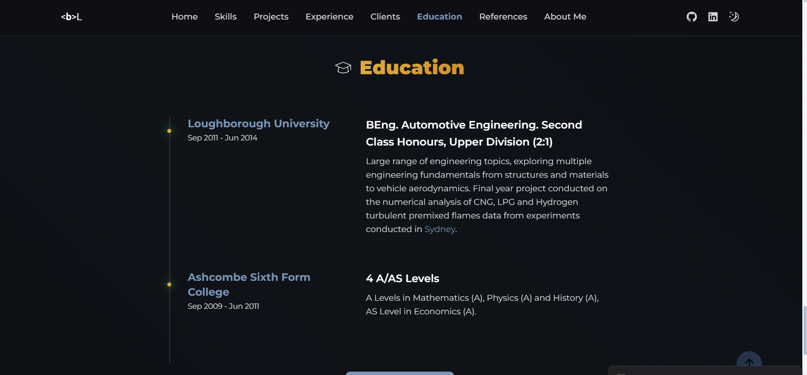
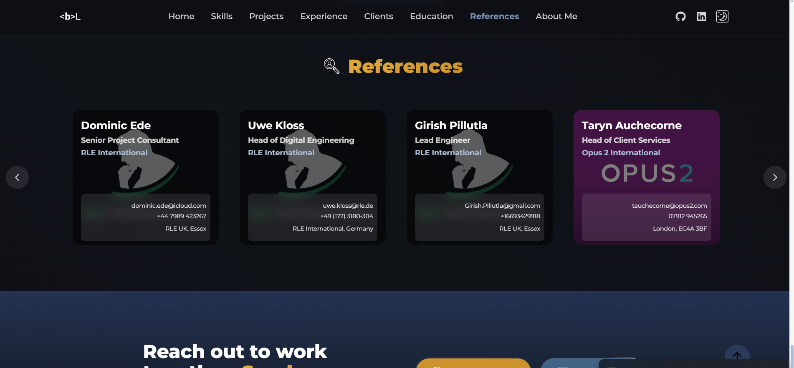

<p align="center">
  
</p>

# Portfolio Site V2

<p align="center">
  A modern, static portfolio website built with Astro and Tailwind CSS, featuring integrated Obsidian note syncing for seamless content management and a comprehensive project showcase system.
</p>

<p align="center">
  <a href="https://bangsluke-portfolio.netlify.app/">🌐 Live Demo</a> •
  <a href="https://github.com/bangsluke/Portfolio-V2">💻 GitHub Repository</a> •
  <a href="#key-benefits">✨ Key Benefits</a> •
  <a href="#features">✨ Features</a> •
  <a href="#screenshots">📸 Screenshots</a> •
</p>

<p align="center">
  <a href="https://app.netlify.com/projects/bangsluke-portfolio/deploys" style="text-decoration: none;">
    
  </a>
  
  
  
  
  
</p>

<p align="center">
  
</p>

## Table of Contents

- [Table of Contents](#table-of-contents)
- [Introduction](#introduction)
  - [Key Benefits](#key-benefits)
  - [Features](#features)
  - [Screenshots](#screenshots)
    - [Portfolio Introduction](#portfolio-introduction)
    - [Skills](#skills)
    - [Projects](#projects)
    - [Work Experience](#work-experience)
    - [Customers and Clients](#customers-and-clients)
    - [Education](#education)
    - [References](#references)
    - [About Me](#about-me)
- [How It Works](#how-it-works)
- [Quick Start](#quick-start)
  - [Prerequisites](#prerequisites)
  - [Installation](#installation)
  - [Environment Configuration](#environment-configuration)
  - [Development](#development)
  - [Production](#production)
- [Obsidian Sync System](#obsidian-sync-system)
  - [Overview](#overview)
  - [Quick Sync Commands](#quick-sync-commands)
  - [Configuration](#configuration)
    - [Environment Variables](#environment-variables)
    - [Default Paths](#default-paths)
  - [Tag System](#tag-system)
    - [Tagging Your Notes](#tagging-your-notes)
  - [Usage Examples](#usage-examples)
    - [Local Development](#local-development)
    - [Production Deployment](#production-deployment)
    - [Custom Path](#custom-path)
    - [Custom Tag](#custom-tag)
    - [Email Notifications](#email-notifications)
  - [Mobile Sync](#mobile-sync)
    - [Android](#android)
    - [iOS](#ios)
  - [GitHub Actions Integration](#github-actions-integration)
    - [Manual Trigger](#manual-trigger)
    - [Automated Deployment](#automated-deployment)
    - [Setup GitHub Secrets](#setup-github-secrets)
  - [Email Notifications](#email-notifications-1)
    - [Setup](#setup)
    - [Test Email Service](#test-email-service)
    - [Email Content](#email-content)
  - [Troubleshooting](#troubleshooting)
    - [Common Issues](#common-issues)
    - [Debug Mode](#debug-mode)
    - [Manual File Processing](#manual-file-processing)
- [Project Structure](#project-structure)
- [Content Management](#content-management)
  - [Obsidian Integration](#obsidian-integration)
  - [Content Collections](#content-collections)
  - [Markdown Processing](#markdown-processing)
- [Portfolio Features](#portfolio-features)
  - [Project Showcase](#project-showcase)
  - [Skills Display](#skills-display)
  - [Work Experience Timeline](#work-experience-timeline)
  - [Education Timeline](#education-timeline)
  - [References](#references-1)
  - [Blog System](#blog-system)
- [Umami Analytics](#umami-analytics)
- [Deployment](#deployment)
  - [Netlify](#netlify)
  - [GitHub Actions](#github-actions)
- [Development](#development-1)
  - [Tech Stack](#tech-stack)
  - [Scripts](#scripts)
  - [Testing](#testing)
    - [Test Files](#test-files)
    - [Test Integration](#test-integration)
  - [Styling](#styling)

## Introduction

Portfolio Site V2 is a modern, static portfolio website that combines the power of Astro's static site generation with seamless Obsidian integration. Write your content in Obsidian, tag it with `#portfolio`, and watch it automatically sync to your live website. The site features a comprehensive project showcase system with skill pills, work experience timelines, and a blog system.

### Key Benefits

- **⚡ Lightning Fast**: Static site generation for optimal performance
- **📝 Content-First**: Manage all content in Obsidian with familiar markdown
- **🔄 Seamless Sync**: Automatic syncing from Obsidian to your website
- **📱 Responsive**: Mobile-first design with Tailwind CSS
- **🚀 Auto-Deploy**: Continuous deployment with GitHub Actions
- **🎨 Modern UI**: Beautiful, accessible design with dark/light themes
- **🏷️ Smart Tagging**: Organize content with flexible tag system
- **📊 Rich Content**: Projects, skills, experience, education, and blog posts

> [Back to Table of Contents](#table-of-contents)

### Features

- **Static Site Generation**: Built with Astro for optimal performance
- **Obsidian Integration**: Sync selected notes from your Obsidian vault
- **Responsive Design**: Mobile-first approach with Tailwind CSS
- **Auto-Deployment**: GitHub Actions for continuous deployment
- **Email Notifications**: Automated sync reports (optional)
- **Content Collections**: Type-safe content management with [Zod](https://zod.dev) schemas
- **Dark/Light Themes**: Automatic theme switching
- **Search & Filtering**: Find content quickly with tag-based filtering
- **SEO Optimized**: Built-in SEO features with sitemap generation
- **Project Showcase**: Rich project cards with skill pills and hover tooltips
- **Timeline Views**: Work experience and education timelines
- **Blog System**: Markdown-based blog with tag filtering
- **Icon System**: Comprehensive icon library with Astro Icon
- **Mobile Sync**: Cross-platform sync support for mobile devices

> [Back to Table of Contents](#table-of-contents)

### Screenshots

#### Portfolio Introduction

<p align="center">
  
</p>

#### Skills

<p align="center">
  
</p>

#### Projects

<p align="center">
  
</p>

#### Work Experience

<p align="center">
  
</p>

#### Customers and Clients

<p align="center">
  
</p>

#### Education

<p align="center">
  
</p>

#### References

<p align="center">
  
</p>

#### About Me

<p align="center">
  
</p>

> [Back to Table of Contents](#table-of-contents)

## How It Works

The Portfolio site serves static markdown files and displays the data from within these files. These are the following steps;

- When the user triggers the sync function (can be done during development or remotely) using the defined `npm` scripts in [`package.json`](./package.json), the script copies across all `Markdown` notes tagged as `#portfolio` in the connected `Obsidian` vault (path defined in [`.env`](./.env))
- These `Markdown` notes are processed within the [`sync.js`](./scripts/sync.js) file in the function ([`processMarkdownFile()`](./scripts/sync.js#L365)) to format the `Markdown` ready for display on the site;
  - Removes images from the `Obsidian` files (as they aren't copied across from the vault as they aren't needed) - done within the [`processMarkdownFile()`](./scripts/sync.js#L304) script
  - In the `Markdown` note content (ignoring the frontmatter) - see ([`processObsidianLinksInContentOnly()`](./scripts/sync.js#L704));
    - Processes internal links to matched Projects with an alt name `[[Project|Alt name]]` ([`processObsidianLinks()`](./scripts/sync.js#L640)) to link to that Project's individual page (whilst displaying the alt name) and styles the resulting text on the site
    - Processes internal links to matched Projects `[[Project]]` ([`processObsidianLinks()`](./scripts/sync.js#L640)) to link to that Project's individual page and styles the resulting text on the site
    - Processes internal `Obsidian` `[[link]]` ([`processObsidianLinks()`](./scripts/sync.js#L640)) and styles the resulting text on the site
    - Processes external `[Text](link)` `Obsidian` links ([`extractSectionContent()`](./scripts/sync.js#L640)) to create hyperlinks
    - Extracts blocks of text between section headers (which sections are based on the note type - defined in the [`repoConfig.js`](./scripts/repoConfig.js) file) and adds them as properties to the note type for use throughout the site ([`extractSectionsToFrontmatter()`](./scripts/sync.js#L168))
- The processed `Markdown` files are then stored in the [`/content`](./src/content/) folder
- A collection is generated to define the schema types of each note type (project, company, client etc) in the Zod [`config.ts`](./src/content/config.ts) file
- The `Astro` pages ([`./src/pages/`](./src/pages/)) and components ([`./src/components/`](./src/components/)) then read this content data and schema in using collections and then loops through the data using `JavaScript` in the top fenced section (`---`) of the `.astro` files to return `HTML` elements in the lower section of the `.astro` files
- The main page displaying the site content is the [`site.astro`](./src/pages/site.astro) file (TBC - to be corrected later on)
- `Astro` then strips back all `JavaScript` it can from the file output (leaving "`islands`" of `JS` - see [source](https://docs.astro.build/en/concepts/islands/)) and serves the lightweight remaining `HTML`

> [Back to Table of Contents](#table-of-contents)

## Quick Start

### Prerequisites

- **Node.js 18+** installed
- **Git** configured with credentials
- **Obsidian vault** with notes
- **GitHub repository** (for deployment)
- **Deployment platform** (Netlify)

### Installation

```bash
# Clone the repository
git clone https://github.com/yourusername/Portfolio-V2.git
cd Portfolio-V2

# Install dependencies
npm install
```

### Environment Configuration

Create a `.env` file in the root directory:

```bash
# Obsidian Sync Configuration
OBSIDIAN_PATH="/path/to/your/obsidian/vault"
PORTFOLIO_TAG="portfolio"
AUTO_DEPLOY="true"

# Email Notifications (Optional)
EMAIL_NOTIFICATIONS="true"
EMAIL_RECIPIENT="your-email@gmail.com"
GMAIL_USER="your-email@gmail.com"
GMAIL_APP_PASSWORD="your-app-password"

# Deployment (Optional)
NETLIFY_AUTH_TOKEN=your_netlify_token
NETLIFY_SITE_ID=your_site_id
```

### Development

```bash
# Run initial sync
npm run sync

# Start development server
npm run dev

# Open http://localhost:4321 to see your portfolio
```

### Production

```bash
# Build for production
npm run build

# Preview production build
npm run preview
```

> [Back to Table of Contents](#table-of-contents)

## Obsidian Sync System

### Overview

The Obsidian sync system allows you to selectively sync notes from your Obsidian vault to your portfolio website. Only notes tagged with `#portfolio` (or your custom tag) will be synced, giving you complete control over what content is publicly visible.

**Key Features:**

- 🔄 **Selective Sync**: Copy only Obsidian notes with `#portfolio` tag
- 📱 **Mobile Support**: Sync from different devices and platforms (Android, iOS)
- 🚀 **Auto-Deploy**: Automatically deploy changes to production via Netlify
- 🏷️ **Tag Filtering**: Filter notes by tags on the website with dynamic routing
- 🔍 **Search**: Search through your notes with tag-based filtering
- 📝 **Markdown Processing**: Convert Obsidian-specific syntax to standard markdown
- 🤖 **CI/CD Integration**: GitHub Actions for automated deployment and sync
- 🎯 **Smart Filtering**: Only sync notes you want to make public
- 📝 **Error Logging**: Comprehensive error tracking and JSON logging
- 📧 **Email Notifications**: Automated email reports via Gmail with HTML formatting
- ✅ **File Verification**: Ensures copied files exist and have content
- 🔄 **Content Extraction**: Automatically extracts and organizes content sections
- 📊 **Schema Validation**: [Zod](https://zod.dev) schemas ensure content integrity
- 🎨 **Icon Integration**: Automatic icon matching for skills and technologies
- 📱 **Touch Support**: Mobile-optimized sync with touch-friendly interfaces
- 🔗 **Auto-Link Updates**: README function links automatically updated during build process

> [Back to Table of Contents](#table-of-contents)

### Quick Sync Commands

```bash
# Basic sync (copies files without deploying)
npm run sync

# Sync and automatically deploy
npm run sync:prod:deploy

# Sync with email notifications
npm run sync:prod:email

# Sync, deploy, and send email notification
npm run sync:prod:deploy-email

# Use custom tag (e.g., "public" instead of "portfolio")
npm run sync:dev -- --tag "public"

# Mobile-friendly interactive sync
npm run sync:mobile
```

> [Back to Table of Contents](#table-of-contents)

### Configuration

#### Environment Variables

Set these environment variables to customize the sync behavior:

```bash
# Path to your Obsidian vault
export OBSIDIAN_PATH="/path/to/your/obsidian/vault"

# Tag to filter for portfolio notes (default: portfolio)
export PORTFOLIO_TAG="portfolio"

# Auto-deploy after sync
export AUTO_DEPLOY="true"

# For mobile detection
export MOBILE="true"

# Email notifications
export EMAIL_NOTIFICATIONS="true"
export EMAIL_RECIPIENT="your-email@gmail.com"
export GMAIL_USER="your-email@gmail.com"
export GMAIL_APP_PASSWORD="your-app-password"
```

#### Default Paths

The script automatically detects common Obsidian vault locations:

- **Windows**: `C:\Users\bangs\Documents\Obsidian Personal Notes`
- **Android**: `/storage/emulated/0/Download/Obsidian Personal Notes`
- **iOS**: Various paths in the app sandbox

> [Back to Table of Contents](#table-of-contents)

### Tag System

The sync system organizes your notes into folders based on tags:

| Tag          | Folder        | Description             |
| ------------ | ------------- | ----------------------- |
| `#portfolio` | _(required)_  | Main filter tag         |
| `#project`   | `projects/`   | Project showcases       |
| `#client`    | `clients/`    | Client work             |
| `#company`   | `companies/`  | Company experiences     |
| `#education` | `educations/` | Educational background  |
| `#reference` | `references/` | Reference materials     |
| `#role`      | `roles/`      | Job roles               |
| `#skill`     | `skills/`     | Skills and competencies |

#### Tagging Your Notes

Add the `#portfolio` tag to any Obsidian note you want to sync:

**In Frontmatter:**

```yaml
---
title: 'My Project'
date: 2024-01-01
tags: ['portfolio', 'project', 'web-development']
---
```

**In Content:**

```markdown
# My Project

This is a portfolio project that showcases my skills.

#portfolio #project #web-development
```

> [Back to Table of Contents](#table-of-contents)

### Usage Examples

#### Local Development

```bash
# Sync without deploying
npm run sync:dev

# Start development server
npm run dev

# Visit http://localhost:4321 to see your notes
```

#### Production Deployment

```bash
# Sync and deploy to production
npm run sync:prod:deploy
```

#### Custom Path

```bash
# Specify a custom Obsidian vault path
OBSIDIAN_PATH="/custom/path/to/vault" npm run sync:dev
```

#### Custom Tag

```bash
# Use a different tag for filtering
PORTFOLIO_TAG="public" npm run sync:dev
# or
npm run sync:dev -- --tag "showcase"
```

#### Email Notifications

```bash
# Enable email notifications
EMAIL_NOTIFICATIONS="true" npm run sync:prod

# Custom email recipient
EMAIL_NOTIFICATIONS="true" EMAIL_RECIPIENT="custom@email.com" npm run sync:prod
```

> [Back to Table of Contents](#table-of-contents)

### Mobile Sync

#### Android

1. Install Termux or similar terminal app
2. Clone your repository
3. Run the mobile sync script:

```bash
cd Portfolio-V2
npm run sync:mobile
```

#### iOS

Since Obsidian mobile files are sandboxed, use one of these methods:

1. **Files App Export** (Recommended)
   - Export vault as plain text from Obsidian mobile
   - Save to Files app
   - Transfer via AirDrop, iCloud Drive, or USB

2. **Working Copy App**
   - Install Working Copy from App Store
   - Clone repository to iPhone
   - Export and commit changes

3. **iOS Shortcuts**
   - Import the provided template
   - Create automation for file transfer

4. **GitHub Actions**
   - Use automated workflow
   - Manual trigger from GitHub

See [iOS Sync Guide](scripts/ios-sync-guide.md) for detailed instructions.

> [Back to Table of Contents](#table-of-contents)

### GitHub Actions Integration

#### Manual Trigger

1. Go to your GitHub repository
2. Navigate to Actions → "Obsidian Sync & Deploy"
3. Click "Run workflow"
4. Optionally specify:
   - Obsidian vault path
   - Portfolio tag
   - Auto-deploy setting

#### Automated Deployment

The workflow can be triggered by:

- **Manual**: Using the workflow dispatch
- **Scheduled**: Daily at 2 AM UTC
- **Push**: When changes are made to `src/content/` or `scripts/`

#### Setup GitHub Secrets

Add these secrets to your GitHub repository:

```bash
# For Netlify deployment
NETLIFY_AUTH_TOKEN=your_netlify_token
NETLIFY_SITE_ID=your_netlify_site_id
```

> [Back to Table of Contents](#table-of-contents)

### Email Notifications

#### Setup

1. **Enable 2-Factor Authentication** on your Gmail account
2. **Generate App Password**:
   - Go to Google Account settings
   - Security → 2-Step Verification → App passwords
   - Generate password for "Mail"
3. **Configure Environment Variables**:

```bash
EMAIL_NOTIFICATIONS="true"
EMAIL_RECIPIENT="your-email@gmail.com"
GMAIL_USER="your-email@gmail.com"
GMAIL_APP_PASSWORD="your-app-password"
```

#### Test Email Service

```bash
# Test email configuration
npm run test-email
```

#### Email Content

The sync script sends detailed HTML emails including:

- Sync status (success/failure)
- File processing summary
- Error details in formatted tables
- Timestamps and source information

> [Back to Table of Contents](#table-of-contents)

### Troubleshooting

#### Common Issues

**1. "Obsidian vault path not found"**

- Verify `OBSIDIAN_PATH` environment variable
- Check that the path exists and is accessible

**2. "No files synced"**

- Ensure notes have the `#portfolio` tag
- Check file permissions
- Verify file extensions are supported

**3. "Email notifications not working"**

- Verify Gmail app password is correct
- Check 2-factor authentication is enabled
- Test with `npm run test-email`

#### Debug Mode

```bash
# Run with debug logging
DEBUG=true npm run sync:dev
```

#### Manual File Processing

```bash
# Process specific files
node scripts/process-obsidian-markdown.js --file "path/to/file.md"
```

> [Back to Table of Contents](#table-of-contents)

## Project Structure

```
Portfolio-V2/
├── src/
│   ├── content/           # Synced Obsidian notes
│   │   ├── companies/     # Company information and experiences
│   │   ├── projects/      # Project showcases and portfolios
│   │   ├── clients/       # Client work and relationships
│   │   ├── educations/    # Educational background and qualifications
│   │   ├── references/    # Professional references and testimonials
│   │   ├── roles/         # Job roles and positions
│   │   ├── skills/        # Technical skills and competencies
│   │   ├── staticData/    # Static configuration and metadata
│   │   └── config.ts      # [Zod](https://zod.dev) schemas for content validation
│   ├── components/        # Reusable UI components
│   │   ├── blog/          # Blog-specific components
│   │   ├── layout/        # Layout and navigation components
│   │   ├── portfolio/     # Portfolio-specific components
│   │   └── ui/            # Generic UI components (buttons, pills, etc.)
│   ├── layouts/           # Astro page layouts
│   ├── pages/             # Astro pages and routes
│   │   ├── blog/          # Blog pages and posts
│   │   ├── notes/         # Dynamic note pages
│   │   └── portfolio/     # Portfolio project pages
│   ├── icons/             # SVG icon library (100+ technology icons)
│   ├── styles/            # Global styles and Tailwind configuration
│   ├── utils/             # Utility functions and helpers
│   └── hooks/             # React/Preact hooks
├── scripts/               # Sync and deployment scripts
│   ├── sync.js            # Main Obsidian sync script (34KB)
│   ├── process-obsidian-markdown.js  # Markdown processing utilities
│   ├── email-service.js   # Email notification system
│   ├── deploy.sh          # Deployment automation script
│   ├── watch-obsidian.js  # File watching for development
│   ├── update-icons.cjs   # Icon library management
│   ├── ios-shortcut-template.json  # iOS automation template
│   └── ios-sync-guide.md  # iOS sync instructions
├── public/                # Static assets and images
│   ├── images/            # Project images and screenshots
│   └── favicon/           # Site favicons and icons
├── .github/workflows/     # GitHub Actions workflows
├── archive/               # Archived content and old versions
└── dist/                  # Build output (generated)
```

> [Back to Table of Contents](#table-of-contents)

## Content Management

### Obsidian Integration

The portfolio uses Obsidian as the primary content management system:

1. **Write in Obsidian**: Create and edit notes in your Obsidian vault
2. **Tag for Portfolio**: Add `#portfolio` tag to notes you want to sync
3. **Organize with Tags**: Use additional tags to organize content into sections
4. **Sync Automatically**: Run sync commands to update your website

### Content Collections

Astro's content collections provide type-safe content management:

- **Projects**: Showcase your work and projects
- **Companies**: Display company experiences
- **Clients**: Highlight client work
- **Skills**: List your technical skills
- **Education**: Show your educational background
- **References**: Include testimonials and references

### Markdown Processing

The sync system automatically converts Obsidian-specific syntax:

- **Internal Links**: `[[Note Name]]` → Standard markdown links with proper URL generation
- **Tags**: `#tag` → Preserved for filtering and categorization
- **Callouts**: `> [!note]` → HTML blockquotes with styling
- **Frontmatter**: YAML metadata preserved and enhanced with [Zod](https://zod.dev) validation
- **Code Blocks**: Syntax highlighting with Prism.js
- **Images**: Automatic image processing and optimization
- **Obsidian Syntax**: Handles Obsidian-specific features like dataview and meta-bind
- **Content Extraction**: Automatically extracts sections like descriptions, achievements, and lessons learned

> [Back to Table of Contents](#table-of-contents)

## Portfolio Features

### Project Showcase

The portfolio features a sophisticated project showcase system:

- **Interactive Project Cards**: Rich cards with hover effects, skill pills, and company information
- **Skill Pills with Tooltips**: Display up to 5 skills per project with a "+" indicator showing additional skills on hover
- **Company Integration**: Link projects to companies with logo tooltips
- **Responsive Design**: Optimized for desktop, tablet, and mobile devices
- **Image Support**: Project screenshots and company logos
- **Technology Stack**: Visual representation of technologies used

### Skills Display

Comprehensive skills management system:

- **Skill Pills**: Visual skill representation with icons and ratings
- **Icon Integration**: Automatic icon matching for common technologies
- **Skill Categories**: Organize skills by technology type
- **Rating System**: Skill proficiency levels
- **Responsive Grid**: Adaptive layout for different screen sizes

### Work Experience Timeline

Professional experience presentation:

- **Chronological Timeline**: Visual timeline of work experience
- **Company Integration**: Links to company pages with logos
- **Role Details**: Comprehensive role descriptions and achievements
- **Date Ranges**: Start and end dates with duration calculation
- **Responsive Design**: Mobile-optimized timeline view

### Education Timeline

Educational background showcase:

- **Academic Timeline**: Chronological education history
- **Institution Logos**: Visual representation of educational institutions
- **Qualification Details**: Degrees, certifications, and achievements
- **Date Tracking**: Academic periods and completion dates
- **Responsive Layout**: Mobile-friendly education display

### References

- **Reference Cards**: Professional references with contact information
- **Company Links**: Connect references to companies
- **Contact Details**: Email, phone, and address information
- **Role Information**: Reference roles and positions
- **Professional Presentation**: Clean, professional reference display

### Blog System

Content management and blogging:

- **Markdown Support**: Write posts in Obsidian with full markdown support
- **Tag System**: Categorize posts with flexible tagging
- **SEO Optimization**: Built-in SEO features for blog posts
- **RSS Feed**: Automatic RSS feed generation
- **Responsive Design**: Mobile-optimized blog layout

> [Back to Table of Contents](#table-of-contents)

## Umami Analytics

The site uses [Umami](https://umami.is) for privacy-friendly analytics. Tracking is implemented via the `@yeskunall/astro-umami` integration and custom events so you can measure engagement without cookies.

**What’s tracked**

- **Traffic**: Pageviews, visitors, and visits (built-in).
- **Engagement**: Clicks to LinkedIn/GitHub, “Contact Me”, Download CV, About Me page views, skills search and toggle, project card clicks, “See more projects” / “See more items” (experience & education), and “Visit Site” / “View Code” on project pages.

**Setup**

- Set `UMAMI_WEBSITE_ID` and optionally `UMAMI_ENABLED` (and `UMAMI_URL` if self-hosting) in your environment (see [Environment Configuration](#environment-configuration)). In production, also set `UMAMI_API_KEY` in Netlify if you use the weekly report (below).

**Reporting**

- **Umami Cloud**: View events and breakdowns in [Umami Cloud](https://cloud.umami.is) (Events, Pages, Properties).
- **Google Sheets**: Use the Umami API or the provided Google Apps Script (multi-project, 24h/7d/30d visits and trends) to pull metrics into a sheet. See the full guide for copy-paste script and formulas.
- **Weekly email**: A Netlify Scheduled Function (`netlify/functions/umami-report.mjs`) runs weekly and emails an HTML summary via Gmail. Configure `UMAMI_WEBSITE_ID`, `UMAMI_API_KEY`, and Gmail env vars in the Netlify dashboard.

**Full guide**: [docs/UMAMI_TRACKING_REPORT.md](docs/UMAMI_TRACKING_REPORT.md) — event mapping, Umami UI steps, Google Sheets script and custom functions, and weekly report setup.

> [Back to Table of Contents](#table-of-contents)

## Deployment

### Netlify

1. **Connect Repository**:
   - Connect your GitHub repository to [Netlify](https://netlify.com)
   - Set build command: `npm run build`
   - Set publish directory: `dist`

2. **Environment Variables**:
   - Add your environment variables in [Netlify dashboard](https://app.netlify.com)
   - Include all sync-related variables

3. **Deploy**:
   - Push changes to trigger automatic deployment
   - Or use manual sync commands

> [Back to Table of Contents](#table-of-contents)

### GitHub Actions

The included workflow automatically syncs and deploys:

```yaml
name: Obsidian Sync & Deploy

on:
  workflow_dispatch: # Manual trigger
  schedule:
    - cron: '0 2 * * *' # Daily at 2 AM UTC
  push:
    paths:
      - 'src/content/**'
      - 'scripts/**'

jobs:
  sync-and-deploy:
    runs-on: ubuntu-latest

    steps:
      - uses: actions/checkout@v3

      - name: Setup Node.js
        uses: actions/setup-node@v3
        with:
          node-version: '18'
          cache: 'npm'

      - name: Install dependencies
        run: npm ci

      - name: Run Obsidian sync
        env:
          OBSIDIAN_PATH: ${{ secrets.OBSIDIAN_PATH }}
          PORTFOLIO_TAG: ${{ secrets.PORTFOLIO_TAG }}
          AUTO_DEPLOY: ${{ secrets.AUTO_DEPLOY }}
          NETLIFY_AUTH_TOKEN: ${{ secrets.NETLIFY_AUTH_TOKEN }}
          NETLIFY_SITE_ID: ${{ secrets.NETLIFY_SITE_ID }}
          EMAIL_NOTIFICATIONS: ${{ secrets.EMAIL_NOTIFICATIONS }}
          EMAIL_RECIPIENT: ${{ secrets.EMAIL_RECIPIENT }}
        run: npm run sync:prod:deploy-email
```

> [Back to Table of Contents](#table-of-contents)

## Development

### Tech Stack

- **Framework**: [Astro 5.6+](https://astro.build/) - Static site generator with SSR capabilities
- **Styling**: [Tailwind CSS 4.1+](https://tailwindcss.com/) - Utility-first CSS framework
- **Components**: [Preact 10.26+](https://preactjs.com/) - Lightweight React alternative for interactive components
- **Icons**: [Astro Icon](https://github.com/natemoo-re/astro-icon) - Comprehensive icon system with 100+ technology icons
- **Content**: Markdown with Obsidian integration and [Zod](https://zod.dev) schema validation
- **Carousel**: [Flicking](https://github.com/naver/egjs-flicking) - Touch-friendly carousel for project galleries
- **GitHub Integration**: [GitHub Calendar](https://github.com/Bloggify/github-calendar) - GitHub contribution visualization
- **Email**: [Nodemailer](https://nodemailer.com/) - Email notifications for sync operations
- **Deployment**: [Netlify](https://netlify.com) with GitHub Actions for CI/CD
- **Code Highlighting**: [Prism.js](https://prismjs.com/) - Syntax highlighting via Astro's markdown processing

### Scripts

```bash
# Development
npm run dev                    # Start development server
npm run build                  # Build for production
npm run preview                # Preview production build

# Sync Commands
npm run sync                   # Basic sync from Obsidian
npm run sync:dev               # Development sync (no auto-deploy)
npm run sync:dev:debug         # Development sync with debug logging
npm run sync:dev:email         # Development sync with email notifications
npm run sync:prod              # Production sync
npm run sync:prod:debug        # Production sync with debug logging
npm run sync:prod:deploy       # Production sync with auto-deploy
npm run sync:prod:email        # Production sync with email notifications
npm run sync:prod:deploy-email # Production sync with deploy and email
npm run sync:mobile            # Mobile-optimized sync
npm run sync:mobile:debug      # Mobile sync with debug logging

# Content Processing
npm run process-markdown       # Process specific markdown files

# Email & Notifications
npm run test-email             # Test email service configuration

# Utilities
npm run update-icons           # Update icon library
npm run update-readme-links    # Update function links in README (runs automatically during build)

# Code Quality
npm run lint                   # Run ESLint
npm run lint:fix               # Fix ESLint issues
npm run lint:css               # Run Stylelint on CSS files
npm run lint:css:fix           # Fix Stylelint issues automatically
npm run format                 # Format with Prettier
npm run format:check           # Check formatting without fixing

# Testing
npm run test                   # Run all tests
npm run test:watch             # Run tests in watch mode
npm run test:coverage          # Run tests with coverage report
```

### Testing

The project includes a comprehensive Jest testing framework with TypeScript support:

- **Test Framework**: [Jest](https://jestjs.io/) with [ts-jest](https://kulshekhar.github.io/ts-jest/) for TypeScript support
- **Test Environment**: Node.js environment with ES module support
- **Coverage**: HTML, text, and lcov coverage reports
- **Test Organization**: Tests located in `src/__tests__/` directories alongside source files

#### Test Files

- **Date Formatter Tests**: [`src/utils/__tests__/date-formatter.test.ts`](./src/utils/__tests__/date-formatter.test.ts) - Tests for date formatting utilities
- **Languages Utility Tests**: [`src/utils/__tests__/languages.test.ts`](./src/utils/__tests__/languages.test.ts) - Tests for language lookup and fallback functionality
- **Content Processor Tests**: [`src/utils/__tests__/content-processor.test.ts`](./src/utils/__tests__/content-processor.test.ts) - Tests for Obsidian link and markdown processing
- **Test Configuration**: [`jest.config.mjs`](./jest.config.mjs) - Jest configuration with ES module support
- **Test Setup**: [`src/__tests__/jest.setup.ts`](./src/__tests__/jest.setup.ts) - Global test configuration and utilities

#### Test Integration

Tests are automatically run before every build to ensure code quality:

- Build process: `npm run test && npm run update-readme-links && astro build`
- 38 test cases covering utility functions with 100% coverage
- Tests validate date formatting, language lookups, and content processing
- Prevents regressions and ensures reliable functionality

> [Back to Table of Contents](#table-of-contents)

### Styling

The project uses Tailwind CSS 4.1+ with custom design tokens:

- **Color Palette**: Custom theme (#4ade80) and riptide color schemes with dark/light variants
- **Typography**: Montserrat, Roboto, and Open Sans font families
- **Themes**: Automatic dark/light mode switching with system preference detection
- **Components**: Comprehensive component library with consistent design patterns
- **Animations**: Smooth transitions and hover effects using Tailwind's animation utilities
- **Responsive Design**: Mobile-first approach with breakpoint-specific styling
- **Icon System**: 100+ technology icons with automatic matching and fallbacks

> [Back to Table of Contents](#table-of-contents)
